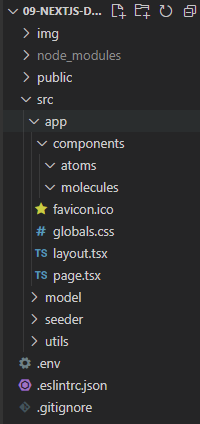

#  09 | Setup Database dan Fetching Data

## Praktikum 1: Setup Database

**Membuat project baru dengan template**

1. Mulailah membuat repo berdasarkan templat starter code ini: https://github.com/jti-polinema/09-nextjs-database (klik pada Use this template) kemudian beri nama repo: 09-nextjs-database pada akun GitHub Anda.

**Membuat Akun Vercel**

2. Selanjutnya buat akun vercel (jika Anda belum memilikinya) di tautan ini https://vercel.com/signup
3. Pilih **plan free "hobby"** dan isi dengan nama Anda.
4. Kemudian pilih **Continue with GitHub** untuk terkoneksi dengan akun Vercel.

**Koneksikan dan Deploy project Anda**

5. Selanjutnya, Anda akan diarahkan screen berikut untuk memilih repo dan impor dari GitHub yang telah Anda buat pada langkah nomor 1 tadi.
6. Beri nama project Anda dan klik Deploy.
7. Tunggu proses deploy selama ± 1 menit.
8. Hooray! 🥳 Project Anda sekarang sudah berhasil deploy di server Vercel.

> **Soal 1**
>
> Capture hasil deploy project Anda dan buatlah laporan di file README.md. Jelaskan apa yang telah Anda pelajari?
>
> Jangan lupa push dengan pesan commit: `"W09: Jawaban soal 1"`.


**Membuat basis data Postgres**

1. Selanjutnya untuk setup database, klik **Continue to Dashboard** dan pilih tab **Storage** pada dashboard project Anda. Lalu pilih **Create** pada basis data **Postgres**.
2. Setujui terms, beri nama basis data, dan pastikan region basis data di set ke **Washington D.C (iad1)** - ini merupakan default region untuk semua project baru di Vercel. Meletakkan basis data pada region yang sama atau semakin dekat dengan kode aplikasi, Anda dapat mengurangi latency pada tiap request data.
3. Setelah berhasil terhubung, arahkan pada tab `.env.local`, klik **Show secret** dan **Copy Snippet** seperti pada gambar berikut.
4. Buat file baru `.env` pada root project Anda, lalu **paste** hasil **Copy Snippet** tersebut.

>**Penting**: Buka file `.gitignore` dan pastikan file `.env` tercantum didalamnya agar konfigurasi rahasia basis data tidak terekspos ketika melakukan push ke GitHub.

5. Akhirnya, jalankan perintah berikut di terminal untuk install Vercel Postgres SDK.
```
npm i --save @vercel/postgres
```

> **Soal 2**
>
> Capture hasil deploy project Anda dan buatlah laporan di file README.md. Jelaskan apa yang telah Anda pelajari?
>
> Jangan lupa push dengan pesan commit: `"W09: Jawaban soal 2"`.

Jawab: Selain dalam hal deployment proyek dari Github, Vercel juga dapat membantu dalam pembuatan Database, pada praktikum ini dilakukan pembuatan database Postgres dengan Vercel, untuk mengakses Database ini maka perlu dibuat file .env dan menambahkan file tersebut ke .gitignore agar kode untuk akses database tersebut tidak ikut terpush ke Github.


**Melakukan seed ke basis data**

1. Sekarang database Anda telah dibuat, mari kita isi dengan beberapa data awal. Ini akan memungkinkan Anda memiliki beberapa data untuk digunakan.
2. Di folder `src/seeder` proyek Anda, ada file bernama `seed.js`. Skrip ini berisi instruksi untuk membuat dan menyemai tabel `invoices`, `customers`, `user`, `revenue`.
3. Jangan khawatir jika Anda tidak memahami semua yang ada dalam kode tersebut, tetapi untuk memberi Anda gambaran umum, skrip itu menggunakan SQL untuk membuat tabel, dan data dari file `src/seeder/data.js` untuk mengisinya setelah tabel tersebut selesai dibuat.
4. Selanjutnya, di file `package.json` Anda, tambahkan baris skrip `seed` seperti berikut:


5. Perintah tersebut akan mengeksekusi file seed.js. Sekarang jalankan perintah berikut di terminal:
```
npm run seed
```
6. Apa yang terjadi ? `error` atau berhasil insert data ke database Postgre ?

>Troubleshooting:
>
> - Jika Anda mengalami error karena module dotenv tidak ada, silakan Anda dapat menginstallnya terlebih dahulu dengan perintah `npm i --save dotenv`
>
> - Jika terjadi error karena module `bcrypt` tidak ditemukan, silakan install dengan perintah `npm i --save bcrypt`
>
> - Jika terjadi error karena `data.js` tidak ditemukan, silakan ubah kode di `seed.js` menjadi seperti ini: `require('./data.js')`

Jika berhasil melakukan seeding data ke database Postgre Vercel, maka akan tampil seperti gambar berikut.


>Soal 3
>
>Capture hasil `npm run seed` Anda dan buatlah laporan di file **README.md.** Jelaskan apa yang telah Anda pelajari ?
>
>Jangan lupa push dengan pesan commit: "`W09: Jawaban soal 3`".

Jawab: Dari file yand sudah dibuat tersebut, masing-masing memiliki kegunaan. File seed.js berguna untuk menginputkan data dan tabel kedalam database, sedangkan data.js berguna untuk menentukan data apa saja yang akan diinputkan ditiap tabel.


**Menjelajah Basis Data**

1. Buka akun vercel Anda, cek pada sidenav klik **Data** seperti gambar di bawah ini.
2. Pada bagian Browser, Anda akan melihat tabel baru terdiri dari: users, customers, invoices, dan revenue.
3. Dengan memilih setiap tabel tersebut, pastikan data telah sesuai seperti pada file `src/seeder/data.js`
4. Anda dapat melakukan query SQL dengan klik tab **Query**.
5. Cobalah eksekusi query berikut ini.
```sql
SELECT invoices.amount, customers.name
FROM invoices
JOIN customers ON invoices.customer_id = customers.id
WHERE invoices.amount = 666;
```

>**Soal 4**
>
>Capture hasil query Anda dan buatlah laporan di file README.md. Jelaskan apa yang telah Anda pelajari ? Cobalah eksekusi query SQL yang lain sesuai kreasi Anda, capture hasilnya dan jelaskan!
>
>Jangan lupa push dengan pesan commit: "W09: Jawaban soal 4".

Jawab: Dari Query diatas berguna untuk menggabungkan tabel invoices dan customers, dengan hanya menampilkan data amount dan name dari masing-masing tabel dengan key berupa customer_id, dan data yang ditampilkan adalah amount dari invoices yang memiliki nilai 666.


### Praktikum 2: Fetching Data (API)

**Membuat Global Query (Model)**

1. Pertama, siapkan struktur folder project Anda seperti pada gambar berikut ini.


2. Selanjutnya buat 2 file di dalam folder `model` yaitu `definitions.tsx` dan `query.tsx`. Kemudian salin kode berikut ini.

`src/model/definitions.tsx`
```tsx
// This file contains type definitions for your data.
// It describes the shape of the data, and what data type each property should accept.
// For simplicity of teaching, we're manually defining these types.
// However, these types are generated automatically if you're using an ORM such as Prisma.
export type User = {
    id: string;
    name: string;
    email: string;
    password: string;
};

export type Customer = {
    id: string;
    name: string;
    email: string;
    image_url: string;
};

export type Invoice = {
    id: string;
    customer_id: string;
    amount: number;
    date: string;
    // In TypeScript, this is called a string union type.
    // It means that the "status" property can only be one of the two strings: 'pending' or 'paid'.
    status: 'pending' | 'paid';
};

export type Revenue = {
    month: string;
    revenue: number;
};

export type LatestInvoice = {
    id: string;
    name: string;
    image_url: string;
    email: string;
    amount: string;
};

// The database returns a number for amount, but we later format it to a string with the formatCurrency function
export type LatestInvoiceRaw = Omit<LatestInvoice, 'amount'> & {
    amount: number;
};

export type InvoicesTable = {
    id: string;
    customer_id: string;
    name: string;
    email: string;
    image_url: string;
    date: string;
    amount: number;
    status: 'pending' | 'paid';
};

export type CustomersTableType = {
    id: string;
    name: string;
    email: string;
    image_url: string;
    total_invoices: number;
    total_pending: number;
    total_paid: number;
};

export type FormattedCustomersTable = {
    id: string;
    name: string;
    email: string;
    image_url: string;
    total_invoices: number;
    total_pending: string;
    total_paid: string;
};

export type CustomerField = {
    id: string;
    name: string;
};

export type InvoiceForm = {
    id: string;
    customer_id: string;
    amount: number;
    status: 'pending' | 'paid';
};
```

`src/model/query.tsx`
```tsx
import { sql } from '@vercel/postgres';
import {
    CustomerField,
    CustomersTableType,
    InvoiceForm,
    InvoicesTable,
    LatestInvoiceRaw,
    User,
    Revenue,
} from './definitions';
import { formatCurrency } from '../utils/utils';
import { unstable_noStore as noStore } from 'next/cache';

export async function fetchRevenue() {
    // Add noStore() here to prevent the response from being cached.
    // This is equivalent to in fetch(..., {cache: 'no-store'}).
    noStore();
    try {
        // Artificially delay a response for demo purposes.
        // Don't do this in production :)

        // console.log('Fetching revenue data...');
        // await new Promise((resolve) => setTimeout(resolve, 3000));

        const data = await sql<Revenue>`SELECT * FROM revenue`;

        // console.log('Data fetch completed after 3 seconds.');

        return data.rows;
    } catch (error) {
        console.error('Database Error:', error);
        throw new Error('Failed to fetch revenue data.');
    }
}

export async function fetchLatestInvoices() {
    noStore();
    try {
        const data = await sql<LatestInvoiceRaw>`
      SELECT invoices.amount, customers.name, customers.image_url, customers.email, invoices.id
      FROM invoices
      JOIN customers ON invoices.customer_id = customers.id
      ORDER BY invoices.date DESC
      LIMIT 5`;

        const latestInvoices = data.rows.map((invoice) => ({
            ...invoice,
            amount: formatCurrency(invoice.amount),
        }));
        return latestInvoices;
    } catch (error) {
        console.error('Database Error:', error);
        throw new Error('Failed to fetch the latest invoices.');
    }
}

export async function fetchCardData() {
    noStore();
    try {
        // You can probably combine these into a single SQL query
        // However, we are intentionally splitting them to demonstrate
        // how to initialize multiple queries in parallel with JS.
        const invoiceCountPromise = sql`SELECT COUNT(*) FROM invoices`;
        const customerCountPromise = sql`SELECT COUNT(*) FROM customers`;
        const invoiceStatusPromise = sql`SELECT
         SUM(CASE WHEN status = 'paid' THEN amount ELSE 0 END) AS "paid",
         SUM(CASE WHEN status = 'pending' THEN amount ELSE 0 END) AS "pending"
         FROM invoices`;

        const data = await Promise.all([
            invoiceCountPromise,
            customerCountPromise,
            invoiceStatusPromise,
        ]);

        const numberOfInvoices = Number(data[0].rows[0].count ?? '0');
        const numberOfCustomers = Number(data[1].rows[0].count ?? '0');
        const totalPaidInvoices = formatCurrency(data[2].rows[0].paid ?? '0');
        const totalPendingInvoices = formatCurrency(data[2].rows[0].pending ?? '0');

        return {
            numberOfCustomers,
            numberOfInvoices,
            totalPaidInvoices,
            totalPendingInvoices,
        };
    } catch (error) {
        console.error('Database Error:', error);
        throw new Error('Failed to fetch card data.');
    }
}

const ITEMS_PER_PAGE = 6;
export async function fetchFilteredInvoices(
    query: string,
    currentPage: number,
) {
    noStore();
    const offset = (currentPage - 1) * ITEMS_PER_PAGE;

    try {
        const invoices = await sql<InvoicesTable>`
      SELECT
        invoices.id,
        invoices.amount,
        invoices.date,
        invoices.status,
        customers.name,
        customers.email,
        customers.image_url
      FROM invoices
      JOIN customers ON invoices.customer_id = customers.id
      WHERE
        customers.name ILIKE ${`%${query}%`} OR
        customers.email ILIKE ${`%${query}%`} OR
        invoices.amount::text ILIKE ${`%${query}%`} OR
        invoices.date::text ILIKE ${`%${query}%`} OR
        invoices.status ILIKE ${`%${query}%`}
      ORDER BY invoices.date DESC
      LIMIT ${ITEMS_PER_PAGE} OFFSET ${offset}
    `;

        return invoices.rows;
    } catch (error) {
        console.error('Database Error:', error);
        throw new Error('Failed to fetch invoices.');
    }
}

export async function fetchInvoicesPages(query: string) {
    noStore();
    try {
        const count = await sql`SELECT COUNT(*)
    FROM invoices
    JOIN customers ON invoices.customer_id = customers.id
    WHERE
      customers.name ILIKE ${`%${query}%`} OR
      customers.email ILIKE ${`%${query}%`} OR
      invoices.amount::text ILIKE ${`%${query}%`} OR
      invoices.date::text ILIKE ${`%${query}%`} OR
      invoices.status ILIKE ${`%${query}%`}
  `;

        const totalPages = Math.ceil(Number(count.rows[0].count) / ITEMS_PER_PAGE);
        return totalPages;
    } catch (error) {
        console.error('Database Error:', error);
        throw new Error('Failed to fetch total number of invoices.');
    }
}

export async function fetchInvoiceById(id: string) {
    noStore();
    try {
        const data = await sql<InvoiceForm>`
      SELECT
        invoices.id,
        invoices.customer_id,
        invoices.amount,
        invoices.status
      FROM invoices
      WHERE invoices.id = ${id};
    `;

        const invoice = data.rows.map((invoice) => ({
            ...invoice,
            // Convert amount from cents to dollars
            amount: invoice.amount / 100,
        }));

        return invoice[0];
    } catch (error) {
        console.error('Database Error:', error);
        throw new Error('Failed to fetch invoice.');
    }
}

export async function fetchCustomers() {
    try {
        const data = await sql<CustomerField>`
      SELECT
        id,
        name
      FROM customers
      ORDER BY name ASC
    `;

        const customers = data.rows;
        return customers;
    } catch (err) {
        console.error('Database Error:', err);
        throw new Error('Failed to fetch all customers.');
    }
}

export async function fetchFilteredCustomers(query: string) {
    noStore();
    try {
        const data = await sql<CustomersTableType>`
                SELECT
                  customers.id,
                  customers.name,
                  customers.email,
                  customers.image_url,
                  COUNT(invoices.id) AS total_invoices,
                  SUM(CASE WHEN invoices.status = 'pending' THEN invoices.amount ELSE 0 END) AS total_pending,
                  SUM(CASE WHEN invoices.status = 'paid' THEN invoices.amount ELSE 0 END) AS total_paid
                FROM customers
                LEFT JOIN invoices ON customers.id = invoices.customer_id
                WHERE
                  customers.name ILIKE ${`%${query}%`} OR
        customers.email ILIKE ${`%${query}%`}
                GROUP BY customers.id, customers.name, customers.email, customers.image_url
                ORDER BY customers.name ASC
          `;

        const customers = data.rows.map((customer) => ({
            ...customer,
            total_pending: formatCurrency(customer.total_pending),
            total_paid: formatCurrency(customer.total_paid),
        }));

        return customers;
    } catch (err) {
        console.error('Database Error:', err);
        throw new Error('Failed to fetch customer table.');
    }
}

export async function getUser(email: string) {
    try {
        const user = await sql`SELECT * FROM users WHERE email=${email}`;
        return user.rows[0] as User;
    } catch (error) {
        console.error('Failed to fetch user:', error);
        throw new Error('Failed to fetch user.');
    }
}
```

3. Kemudian buat file `utils.tsx` di dalam folder `utils` dengan berisi kode berikut.
`src/utils/utils.tsx`
```tsx
import { Revenue } from '../model/definitions';

export const formatCurrency = (amount: number) => {
  return (amount / 100).toLocaleString('en-US', {
    style: 'currency',
    currency: 'USD',
  });
};

export const formatDateToLocal = (
  dateStr: string,
  locale: string = 'en-US',
) => {
  const date = new Date(dateStr);
  const options: Intl.DateTimeFormatOptions = {
    day: 'numeric',
    month: 'short',
    year: 'numeric',
  };
  const formatter = new Intl.DateTimeFormat(locale, options);
  return formatter.format(date);
};

export const generateYAxis = (revenue: Revenue[]) => {
  // Calculate what labels we need to display on the y-axis
  // based on highest record and in 1000s
  const yAxisLabels = [];
  const highestRecord = Math.max(...revenue.map((month) => month.revenue));
  const topLabel = Math.ceil(highestRecord / 1000) * 1000;

  for (let i = topLabel; i >= 0; i -= 1000) {
    yAxisLabels.push(`$${i / 1000}K`);
  }

  return { yAxisLabels, topLabel };
};

export const generatePagination = (currentPage: number, totalPages: number) => {
  // If the total number of pages is 7 or less,
  // display all pages without any ellipsis.
  if (totalPages <= 7) {
    return Array.from({ length: totalPages }, (_, i) => i + 1);
  }

  // If the current page is among the first 3 pages,
  // show the first 3, an ellipsis, and the last 2 pages.
  if (currentPage <= 3) {
    return [1, 2, 3, '...', totalPages - 1, totalPages];
  }

  // If the current page is among the last 3 pages,
  // show the first 2, an ellipsis, and the last 3 pages.
  if (currentPage >= totalPages - 2) {
    return [1, 2, '...', totalPages - 2, totalPages - 1, totalPages];
  }

  // If the current page is somewhere in the middle,
  // show the first page, an ellipsis, the current page and its neighbors,
  // another ellipsis, and the last page.
  return [
    1,
    '...',
    currentPage - 1,
    currentPage,
    currentPage + 1,
    '...',
    totalPages,
  ];
};
```

**Membuat Komponen Atom**

4. Lalu isi folder atoms dengan file fonts.tsx dengan kode berikut.
`src\app\components\atoms\fonts.tsx`
```tsx
import { Inter, Lusitana } from 'next/font/google';

export const inter = Inter({ subsets: ['latin'] });

export const lusitana = Lusitana({
  weight: ['400', '700'],
  subsets: ['latin'],
});
```

5. Buat komponen `molecules`, ada 3 file yaitu `card.tsx`, `latest-invoices.tsx`, dan `revenue-chart.tsx`

`card.tsx`
```tsx
import {
    BanknotesIcon,
    ClockIcon,
    UserGroupIcon,
    InboxIcon,
} from '@heroicons/react/24/outline';
import { lusitana } from '@/app/components/atoms/fonts';
import { fetchCardData } from '@/model/query';

const iconMap = {
    collected: BanknotesIcon,
    customers: UserGroupIcon,
    pending: ClockIcon,
    invoices: InboxIcon,
};

export default async function CardWrapper() {
    const {
        numberOfInvoices,
        numberOfCustomers,
        totalPaidInvoices,
        totalPendingInvoices,
    } = await fetchCardData();

    return (
        <>
            <Card title="Collected" value={totalPaidInvoices} type="collected" />
            <Card title="Pending" value={totalPendingInvoices} type="pending" />
            <Card title="Total Invoices" value={numberOfInvoices} type="invoices" />
            <Card
                title="Total Customers"
                value={numberOfCustomers}
                type="customers"
            />
        </>
    );
}

export function Card({
    title,
    value,
    type,
}: {
    title: string;
    value: number | string;
    type: 'invoices' | 'customers' | 'pending' | 'collected';
}) {
    const Icon = iconMap[type];

    return (
        <div className="rounded-xl bg-gray-50 p-2 shadow-sm">
            <div className="flex p-4">
                {Icon ? <Icon className="h-5 w-5 text-gray-700" /> : null}
                <h3 className="ml-2 text-sm font-medium">{title}</h3>
            </div>
            <p
                className={`${lusitana.className}
            truncate rounded-xl bg-white px-4 py-8 text-center text-2xl`}
            >
                {value}
            </p>
        </div>
    );
}
```

`lates-invoices.tsx`
```tsx
import { ArrowPathIcon } from '@heroicons/react/24/outline';
import clsx from 'clsx';
import Image from 'next/image';
import { lusitana } from '@/app/components/atoms/fonts';
import { fetchLatestInvoices } from '@/model/query';

export default async function LatestInvoices() {
    const latestInvoices = await fetchLatestInvoices();

    return (
        <div className="flex w-full flex-col md:col-span-4">
            <h2 className={`${lusitana.className} mb-4 text-xl md:text-2xl`}>
                Latest Invoices
            </h2>
            <div className="flex grow flex-col justify-between rounded-xl bg-gray-50 p-4">
                <div className="bg-white px-6">
                    {latestInvoices.map((invoice, i) => {
                        return (
                            <div
                                key={invoice.id}
                                className={clsx(
                                    'flex flex-row items-center justify-between py-4',
                                    {
                                        'border-t': i !== 0,
                                    },
                                )}
                            >
                                <div className="flex items-center">
                                    <Image
                                        src={invoice.image_url}
                                        alt={`${invoice.name}'s profile picture`}
                                        className="mr-4 rounded-full"
                                        width={32}
                                        height={32}
                                    />
                                    <div className="min-w-0">
                                        <p className="truncate text-sm font-semibold md:text-base">
                                            {invoice.name}
                                        </p>
                                        <p className="hidden text-sm text-gray-500 sm:block">
                                            {invoice.email}
                                        </p>
                                    </div>
                                </div>
                                <p
                                    className={`${lusitana.className} truncate text-sm font-medium md:text-base`}
                                >
                                    {invoice.amount}
                                </p>
                            </div>
                        );
                    })}
                </div>
                <div className="flex items-center pb-2 pt-6">
                    <ArrowPathIcon className="h-5 w-5 text-gray-500" />
                    <h3 className="ml-2 text-sm text-gray-500 ">Updated just now</h3>
                </div>
            </div>
        </div>
    );
}
```

`revenue-chart.tsx`
```tsx
import { generateYAxis } from '@/utils/utils';
import { CalendarIcon } from '@heroicons/react/24/outline';
import { lusitana } from '@/app/components/atoms/fonts';
import { fetchRevenue } from '@/model/query';

// This component is representational only.
// For data visualization UI, check out:
// https://www.tremor.so/
// https://www.chartjs.org/
// https://airbnb.io/visx/

export default async function RevenueChart() {
    const revenue = await fetchRevenue();

    const chartHeight = 350;
    const { yAxisLabels, topLabel } = generateYAxis(revenue);

    if (!revenue || revenue.length === 0) {
        return <p className="mt-4 text-gray-400">No data available.</p>;
    }

    return (
        <div className="w-full md:col-span-4">
            <h2 className={`${lusitana.className} mb-4 text-xl md:text-2xl`}>
                Recent Revenue
            </h2>
            <div className="rounded-xl bg-gray-50 p-4">
                <div className="mt-0 grid grid-cols-12 items-end gap-2 rounded-md bg-white p-4 sm:grid-cols-13 md:gap-4">
                    {/* y-axis */}
                    <div
                        className="mb-6 hidden flex-col justify-between text-sm text-gray-400 sm:flex"
                        style={{ height: `${chartHeight}px` }}
                    >
                        {yAxisLabels.map((label) => (
                            <p key={label}>{label}</p>
                        ))}
                    </div>

                    {revenue.map((month) => (
                        <div key={month.month} className="flex flex-col items-center gap-2">
                            {/* bars */}
                            <div
                                className="w-full rounded-md bg-blue-300"
                                style={{
                                    height: `${(chartHeight / topLabel) * month.revenue}px`,
                                }}
                            ></div>
                            {/* x-axis */}
                            <p className="-rotate-90 text-sm text-gray-400 sm:rotate-0">
                                {month.month}
                            </p>
                        </div>
                    ))}
                </div>
                <div className="flex items-center pb-2 pt-6">
                    <CalendarIcon className="h-5 w-5 text-gray-500" />
                    <h3 className="ml-2 text-sm text-gray-500 ">Last 12 months</h3>
                </div>
            </div>
        </div>
    );
}
```

> **Troubleshooting:**
>
> - Jika Anda mengalami error karena beberapa modul tidak ditemukan, silakan Anda dapat menginstallnya terlebih dahulu dengan perintah berikut:
> - npm i --save @heroicons/react
> - npm i --save clsx

Kemudian perhatikan pada file `package.json` akan ada tambahan dependensi library yang telah berhasil ter-instal.

6. Terakhir, ganti semua kode di `src/app/page.tsx` dengan kode berikut.
```tsx
import { Card } from '@/app/components/molecules/card';
import RevenueChart from '@/app/components/molecules/revenue-chart';
import LatestInvoices from '@/app/components/molecules/latest-invoices';
import { lusitana } from '@/app/components/atoms/fonts';

export default async function Page() {
  return (
    <main>
      <h1 className={`${lusitana.className} mb-4 text-xl md:text-2xl`}>
        Dashboard
      </h1>
      <div className="grid gap-6 sm:grid-cols-2 lg:grid-cols-4">
        {/* <Card title="Collected" value={totalPaidInvoices} type="collected" /> */}
        {/* <Card title="Pending" value={totalPendingInvoices} type="pending" /> */}
        {/* <Card title="Total Invoices" value={numberOfInvoices} type="invoices" /> */}
        {/* <Card
          title="Total Customers"
          value={numberOfCustomers}
          type="customers"
        /> */}
      </div>
      <div className="mt-6 grid grid-cols-1 gap-6 md:grid-cols-4 lg:grid-cols-8">
        {/* <RevenueChart /> */}
        {/* <LatestInvoices /> */}
      </div>
    </main>
  );
}
```

Penjelasan kode di atas:

- Halaman tersebut adalah sebuah **async** component. Ini menandakan bahwa Anda bisa menggunakan sintaks `await` untuk melakukan fetch data.
- Ada 3 komponen yang akan menerima data: `Card`, `RevenueChart`, dan `LatestInvoices`. Saat ini dalam kondisi di-*comment* agar terhindar dari error pada aplikasi.

> **Soal 5**
>
> Lakukan push, kemudian perhatikan di akun dashboard Vercel project Anda. Capture dan lampirkan link aplikasi Anda yang telah berhasil di deploy, kemudian buatlah laporan di file **README.md**. Jelaskan apa yang telah Anda pelajari ?
>
> Jangan lupa push dengan pesan commit: "**W09: Jawaban soal 5**".

Jawab: Pertama-tama dilakukan pembuatan model definitions yang berguna untuk menentukan struktur data dari setiap model atau tabel yang dibuat. Selanjutnya model query disini dapat membantu dalam memperoleh data dari database dengan berbagai query yang dibutuhkan, selain itu, pada model query ini juga dapat mengolah data yang didapat sebelum dikirimkan ke laman atau client.

Dan pada components mulai dibuat komponen dan laman yang akan ditampilkan, beserta data yang didapatkan, namun saat ini laman yang berguna untuk menampilkan data masih belum dijalankan, untuk mencegah terjadinya error. Setelah components selesai, selanjutnya adalah memperbarui halaman page.tsx yang merupakan tampilan utama, sehingga components yang sudah dibuat dapat diimport dan disajikan di halaman website saat server dijalankan.


**Fetching Data untuk komponen RevenueChart**

7. Buka file src\app\page.tsx
8. Kemudian hapus comment pada komponen RevenueChart
9. Coba running localhost atau langsung deploy ke Vercel dengan cara push.
10. Amati apa yang terjadi ? Jika error atau ada tampilan grafik yang kurang baik, silakan Anda dapat perbaiki.


> **Soal 5**
>
> Lakukan capture dan push hasilnya, kemudian buatlah laporan di file **README.md**. Jelaskan apa yang telah Anda pelajari ?
>
> Jangan lupa push dengan pesan commit: "**W09: Jawaban soal 6**".

Jawab:

Data yang diperoleh dari revenueFetch diolah untuk ditampilkan dalam laman ReactJS, dengan dimulai dari mengekstrak data untuk sumbu X dan Y. Selanjutnya data revenue dikonversi ke format data map, dan terakhir adalah menampilkan data dari map revenue tersebut.

